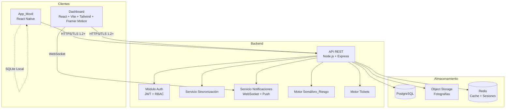
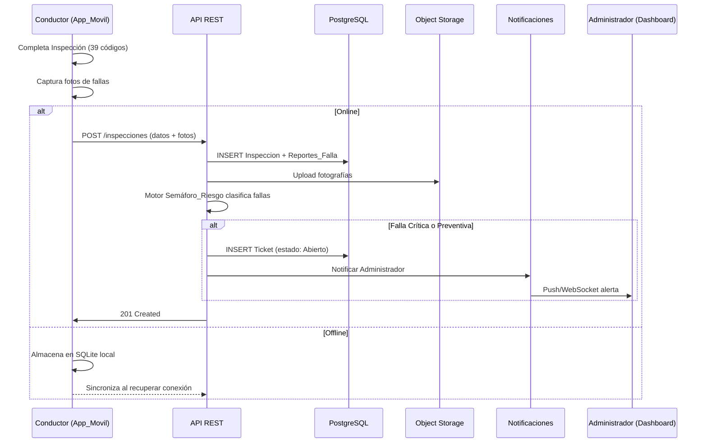
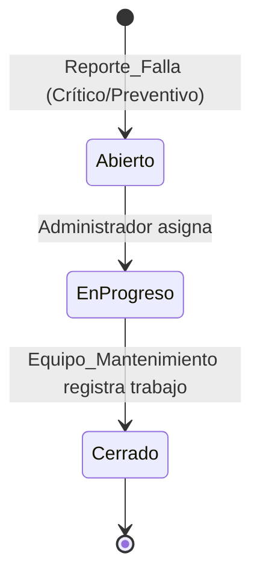
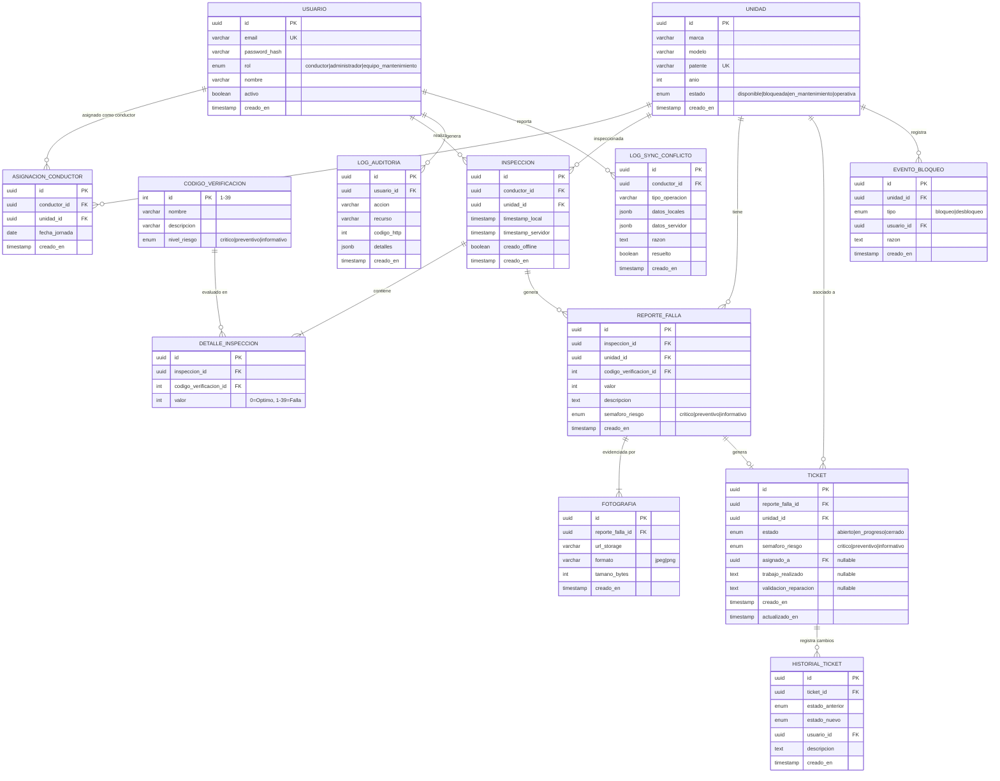

# Documento de Diseño — Sistema de Digitalización y Gestión de Flota Biosur

## Visión General

Este documento describe el diseño técnico del Sistema de Digitalización y Gestión de Flota de Biosur. El sistema reemplaza el proceso manual de inspección vehicular con una plataforma digital compuesta por:

- **App_Movil**: Aplicación móvil (React Native) para conductores, con soporte offline-first.
- **Dashboard**: Panel web (React + Vite + Tailwind CSS + Framer Motion) para administradores y equipo de mantenimiento.
- **Backend**: API REST (Node.js + Express) con base de datos PostgreSQL.

El diseño prioriza la seguridad operativa (bloqueo por fallas críticas), la trazabilidad completa (Hoja_Vida por Unidad) y la resiliencia ante conectividad intermitente (modo offline-first con sincronización automática).

El Dashboard sigue el Design System **"Elemental Purity"** definido en `stitch_biosur/DESIGN.md`, con la paleta de colores Biosur (primary #eb681a, secondary #659833, surface #ede7e0), tipografías Manrope + Inter, y principios de diseño editorial: sin bordes para separar secciones (usar cambios de superficie), sombras ambientales suaves, y esquinas redondeadas (0.5rem+). Referencia visual: `stitch_biosur/code.html`.

---

## Arquitectura

### Diagrama de Arquitectura General



### Decisiones Arquitectónicas

| Decisión | Elección | Justificación |
|---|---|---|
| Framework móvil | React Native | Multiplataforma (iOS/Android), ecosistema maduro para offline-first |
| Framework web | React + Vite | Rendimiento, ecosistema de componentes, hot reload rápido |
| Estilos CSS | Tailwind CSS | Utility-first, diseño responsivo rápido, consistencia visual, bajo overhead |
| Animaciones | Framer Motion | Animaciones declarativas para React, transiciones fluidas, gestos táctiles |
| Backend | Node.js + Express | Asincronía nativa, buen soporte para WebSockets y REST |
| Base de datos | PostgreSQL | Integridad referencial, transacciones ACID, soporte JSON para datos flexibles |
| Almacenamiento fotos | Object Storage (S3-compatible) | Escalable, separación de datos binarios del RDBMS |
| Cache/Sesiones | Redis | Invalidación rápida de sesiones, cache de consultas frecuentes |
| Autenticación | JWT + Refresh Token | Stateless, compatible con offline (token válido localmente) |
| Offline storage | SQLite (dispositivo) | Soporte nativo en React Native, transacciones locales |
| Notificaciones real-time | WebSocket (Dashboard) + Push (App_Movil) | Alertas críticas en ≤30s |
| Cifrado | TLS 1.2+ | Requisito explícito de seguridad |

### Flujo de Datos Principal



---

## Componentes e Interfaces

### 1. Módulo de Autenticación (Auth)

**Responsabilidad**: Gestionar login, sesiones JWT, RBAC y vinculación Conductor-Unidad.

```typescript
// Interfaces principales
interface AuthService {
  login(credentials: LoginRequest): Promise<AuthResponse>;
  logout(token: string): Promise<void>;
  refreshToken(refreshToken: string): Promise<AuthResponse>;
  validateToken(token: string): Promise<TokenPayload>;
}

interface LoginRequest {
  email: string;
  password: string;
}

interface AuthResponse {
  accessToken: string;       // JWT, expira en 1h
  refreshToken: string;      // Expira en 7d
  user: UserProfile;
  unidadAsignada?: Unidad;   // Solo para rol Conductor
}

interface TokenPayload {
  userId: string;
  rol: 'conductor' | 'administrador' | 'equipo_mantenimiento';
  unidadId?: string;
}
```

**Middleware RBAC**:
```typescript
interface RBACMiddleware {
  authorize(rolesPermitidos: Rol[]): RequestHandler;
  // Retorna 403 y registra en log de auditoría si el rol no está permitido
}
```

### 2. Módulo de Inspecciones

**Responsabilidad**: Registrar inspecciones diarias con los 39 códigos de verificación.

```typescript
interface InspeccionService {
  crear(data: CrearInspeccionDTO): Promise<Inspeccion>;
  obtenerPorUnidad(unidadId: string, filtros?: FiltroFecha): Promise<Inspeccion[]>;
  obtenerPorConductor(conductorId: string, filtros?: FiltroFecha): Promise<Inspeccion[]>;
}

interface CrearInspeccionDTO {
  conductorId: string;
  unidadId: string;
  codigos: CodigoVerificacionEntry[];  // Exactamente 39 entradas
  creadoOffline: boolean;
  timestampLocal: Date;
}

interface CodigoVerificacionEntry {
  codigoId: number;          // 1-39
  valor: number;             // 0 = Óptimo, 1-39 = Falla específica
}
```

**Validación**: El servicio rechaza inspecciones con menos o más de 39 códigos, o con valores fuera del rango permitido.

### 3. Módulo de Reportes de Falla

**Responsabilidad**: Generar reportes de falla con evidencia fotográfica y clasificación de riesgo.

```typescript
interface ReporteFallaService {
  crear(data: CrearReporteFallaDTO): Promise<ReporteFalla>;
  obtenerPorUnidad(unidadId: string, filtros?: FiltroSemaforo): Promise<ReporteFalla[]>;
  obtenerPorSemaforo(nivel: NivelRiesgo): Promise<ReporteFalla[]>;
}

interface CrearReporteFallaDTO {
  inspeccionId: string;
  codigoVerificacionId: number;
  valor: number;                    // 1-39
  descripcion: string;
  fotografias: FotografiaInput[];   // Mínimo 1
}

interface FotografiaInput {
  archivo: Buffer;
  formato: 'jpeg' | 'png';
  tamanoBytes: number;              // Máximo 10MB (10_485_760 bytes)
}
```

### 4. Motor de Semáforo de Riesgo

**Responsabilidad**: Clasificar automáticamente cada falla según su código de verificación.

```typescript
interface SemaforoRiesgoService {
  clasificar(codigoVerificacionId: number): NivelRiesgo;
  obtenerClasificacion(): Map<number, NivelRiesgo>;
}

type NivelRiesgo = 'critico' | 'preventivo' | 'informativo';

// La clasificación es una tabla estática configurable:
// Cada código de verificación (1-39) tiene un nivel de riesgo predefinido.
// Ejemplo: código 1 (frenos) → Crítico, código 15 (limpieza) → Informativo
```

### 5. Motor de Tickets

**Responsabilidad**: Gestionar el ciclo de vida completo del ticket de reparación.

```typescript
interface TicketService {
  crear(reporteFallaId: string): Promise<Ticket>;
  asignar(ticketId: string, equipoMantenimientoId: string): Promise<Ticket>;
  cerrar(ticketId: string, cierre: CierreTicketDTO): Promise<Ticket>;
  obtenerPorUnidad(unidadId: string): Promise<Ticket[]>;
  obtenerPorAsignado(userId: string): Promise<Ticket[]>;
}

interface CierreTicketDTO {
  trabajoRealizado: string;
  validacionReparacion: string;
  userId: string;
}

// Estados: Abierto → En Progreso → Cerrado
// Transiciones válidas controladas por máquina de estados
```

**Máquina de Estados del Ticket**:


### 6. Servicio de Sincronización Offline

**Responsabilidad**: Gestionar la cola de sincronización y resolución de conflictos.

```typescript
interface SyncService {
  encolar(operacion: OperacionPendiente): Promise<void>;
  sincronizar(): Promise<SyncResult>;
  obtenerPendientes(): Promise<OperacionPendiente[]>;
}

interface OperacionPendiente {
  id: string;
  tipo: 'inspeccion' | 'reporte_falla';
  datos: unknown;
  timestampLocal: Date;
  intentos: number;
}

interface SyncResult {
  exitosos: number;
  fallidos: number;
  conflictos: ConflictoSync[];
}

interface ConflictoSync {
  operacionId: string;
  razon: string;
  datosLocales: unknown;
  datosServidor: unknown;
}
```

### 7. Servicio de Notificaciones

**Responsabilidad**: Enviar alertas en tiempo real (≤30s) para fallas críticas.

```typescript
interface NotificacionService {
  enviarAlertaCritica(reporteFalla: ReporteFalla): Promise<void>;
  enviarNotificacionTicket(ticket: Ticket, evento: EventoTicket): Promise<void>;
  suscribir(userId: string, canal: 'websocket' | 'push'): void;
}
```

### 8. Módulo Hoja de Vida

**Responsabilidad**: Consolidar y consultar el historial técnico completo por Unidad.

```typescript
interface HojaVidaService {
  obtener(unidadId: string, filtros?: FiltroHojaVida): Promise<HojaVida>;
  registrarEvento(unidadId: string, evento: EventoHojaVida): Promise<void>;
}

interface FiltroHojaVida {
  fechaDesde?: Date;
  fechaHasta?: Date;
  tipoFalla?: number;
  estadoTicket?: EstadoTicket;
}

interface HojaVida {
  unidad: Unidad;
  inspecciones: Inspeccion[];
  reportesFalla: ReporteFalla[];
  tickets: Ticket[];
  eventosBloqueDesbloqueo: EventoBloqueo[];
}
```

### 9. Módulo de BI y Exportación

**Responsabilidad**: Calcular indicadores de flota y exportar datos.

```typescript
interface BIService {
  calcularIndicadores(filtros: FiltroPeriodo): Promise<IndicadoresFlota>;
  exportarCSV(filtros: FiltroPeriodo): Promise<Buffer>;
}

interface IndicadoresFlota {
  porcentajeUnidadesOperativas: number;
  tiempoPromedioReparacion: number;    // en horas
  frecuenciaFallasPorUnidad: Map<string, number>;
  periodo: FiltroPeriodo;
}
```

### Endpoints API REST Principales

| Método | Ruta | Rol(es) | Descripción |
|---|---|---|---|
| POST | `/auth/login` | Público | Autenticación |
| POST | `/auth/logout` | Todos | Cerrar sesión |
| POST | `/inspecciones` | Conductor | Registrar inspección |
| POST | `/inspecciones/sync` | Conductor | Sincronizar inspecciones offline |
| GET | `/inspecciones?unidadId=X` | Admin | Listar inspecciones por unidad |
| POST | `/reportes-falla` | Conductor | Crear reporte de falla |
| GET | `/reportes-falla?semaforo=X` | Admin | Filtrar por semáforo |
| POST | `/tickets/:id/asignar` | Admin | Asignar ticket |
| POST | `/tickets/:id/cerrar` | Equipo_Mant. | Cerrar ticket |
| GET | `/unidades/:id/hoja-vida` | Admin | Consultar hoja de vida |
| GET | `/dashboard/estado-flota` | Admin | Estado general de flota |
| GET | `/dashboard/bi` | Admin | Indicadores BI |
| GET | `/dashboard/bi/exportar` | Admin | Exportar CSV |

---

## Modelos de Datos

### Diagrama Entidad-Relación



### Tablas Principales

**USUARIO**: Almacena conductores, administradores y equipo de mantenimiento. El campo `rol` determina los permisos RBAC.

**UNIDAD**: Cada vehículo de la flota. El campo `estado` se actualiza automáticamente según los tickets activos.

**ASIGNACION_CONDUCTOR**: Relación diaria entre conductor y unidad. Permite que un conductor tenga diferentes unidades en diferentes jornadas.

**INSPECCION + DETALLE_INSPECCION**: Cada inspección tiene exactamente 39 registros de detalle (uno por código de verificación). El campo `creado_offline` indica si fue creada sin conexión.

**REPORTE_FALLA**: Se genera automáticamente por cada `DETALLE_INSPECCION` con valor ≠ 0. Incluye la clasificación de semáforo heredada del `CODIGO_VERIFICACION`.

**FOTOGRAFIA**: Almacena la referencia al object storage. Mínimo 1 por reporte de falla. Máximo 10 MB por imagen, formatos JPEG/PNG.

**TICKET**: Ciclo de vida: Abierto → En Progreso → Cerrado. Solo se crea para fallas Críticas o Preventivas.

**HISTORIAL_TICKET**: Registro inmutable de cada transición de estado con timestamp y usuario responsable.

**EVENTO_BLOQUEO**: Registra cada bloqueo/desbloqueo de unidad para la Hoja_Vida.

### Índices Recomendados

```sql
-- Consultas frecuentes por unidad y fecha
CREATE INDEX idx_inspeccion_unidad_fecha ON inspeccion(unidad_id, creado_en DESC);
CREATE INDEX idx_reporte_falla_unidad ON reporte_falla(unidad_id, creado_en DESC);
CREATE INDEX idx_reporte_falla_semaforo ON reporte_falla(semaforo_riesgo);
CREATE INDEX idx_ticket_unidad_estado ON ticket(unidad_id, estado);
CREATE INDEX idx_ticket_asignado ON ticket(asignado_a, estado);
CREATE INDEX idx_evento_bloqueo_unidad ON evento_bloqueo(unidad_id, creado_en DESC);
CREATE INDEX idx_asignacion_conductor_fecha ON asignacion_conductor(conductor_id, fecha_jornada);
```


---

## Propiedades de Correctitud

*Una propiedad es una característica o comportamiento que debe mantenerse verdadero en todas las ejecuciones válidas de un sistema — esencialmente, una declaración formal sobre lo que el sistema debe hacer. Las propiedades sirven como puente entre especificaciones legibles por humanos y garantías de correctitud verificables por máquina.*

### Propiedad 1: RBAC comprehensivo

*Para cualquier* combinación de (rol de usuario, endpoint/función), el sistema debe permitir el acceso si y solo si el rol tiene permiso según la matriz RBAC definida. Cuando el acceso es denegado, la respuesta debe ser HTTP 403 y el intento debe registrarse en el log de auditoría con userId, recurso solicitado y timestamp.

**Valida: Requerimientos 1.2, 1.3, 10.2, 10.3, 10.4, 10.5**

### Propiedad 2: Validación de inspección completa

*Para cualquier* inspección enviada, el sistema debe aceptarla si y solo si contiene exactamente 39 entradas de código de verificación, cada una con un valor en el rango [0, 39]. Inspecciones con menos de 39 códigos, más de 39 códigos, o valores fuera de rango deben ser rechazadas.

**Valida: Requerimientos 2.2, 2.5**

### Propiedad 3: Registro de inspección con integridad

*Para cualquier* inspección completada y aceptada, el registro resultante debe contener un timestamp no nulo, un conductorId válido, un unidadId válido, y la inspección debe aparecer en la Hoja_Vida de la unidad correspondiente.

**Valida: Requerimientos 2.3, 2.4**

### Propiedad 4: Validación de reporte de falla con fotografía

*Para cualquier* reporte de falla (código de verificación con valor 1-39), el sistema debe requerir al menos una fotografía adjunta en formato JPEG o PNG con tamaño ≤ 10 MB. Reportes sin fotografía, con formato no soportado, o con fotografías que excedan 10 MB deben ser rechazados.

**Valida: Requerimientos 3.1, 3.2, 3.4**

### Propiedad 5: Clasificación automática de semáforo de riesgo

*Para cualquier* reporte de falla generado, el nivel de Semáforo_Riesgo asignado automáticamente debe coincidir exactamente con la clasificación predefinida del código de verificación correspondiente en la tabla de configuración.

**Valida: Requerimientos 5.1**

### Propiedad 6: Filtrado por semáforo de riesgo

*Para cualquier* consulta de reportes de falla filtrada por un nivel de Semáforo_Riesgo específico, todos los resultados retornados deben tener ese nivel de semáforo, y ningún reporte con ese nivel debe ser omitido del resultado.

**Valida: Requerimientos 5.4**

### Propiedad 7: Invariante de bloqueo de seguridad

*Para cualquier* unidad, el cambio de estado a "Disponible" debe ser permitido si y solo si la unidad no tiene ningún ticket con Semáforo_Riesgo Crítico en estado "Abierto" o "En Progreso". Esta invariante debe mantenerse tanto al intentar el cambio manual como al cerrar tickets.

**Valida: Requerimientos 6.1, 6.3**

### Propiedad 8: Auditoría de bloqueo y desbloqueo

*Para cualquier* evento de bloqueo o desbloqueo de una unidad, el sistema debe registrar en la Hoja_Vida un evento con timestamp no nulo, userId del responsable no nulo, y tipo de evento (bloqueo/desbloqueo).

**Valida: Requerimientos 6.4**

### Propiedad 9: Creación automática de tickets

*Para cualquier* reporte de falla, se debe crear un ticket automáticamente en estado "Abierto" si y solo si el Semáforo_Riesgo es "Crítico" o "Preventivo". Reportes con semáforo "Informativo" no deben generar ticket.

**Valida: Requerimientos 7.1**

### Propiedad 10: Máquina de estados del ticket

*Para cualquier* ticket, las únicas transiciones de estado válidas son: Abierto → En Progreso (al asignar) y En Progreso → Cerrado (al registrar trabajo). Cualquier otra transición (Abierto → Cerrado, En Progreso → Abierto, Cerrado → cualquier estado) debe ser rechazada.

**Valida: Requerimientos 7.2, 7.3**

### Propiedad 11: Auditoría de transiciones de ticket

*Para cualquier* cambio de estado de un ticket, el sistema debe crear un registro en historial_ticket con: estado anterior, estado nuevo, timestamp no nulo, userId del responsable no nulo, y descripción no vacía al momento del cierre.

**Valida: Requerimientos 7.4**

### Propiedad 12: Validación de cierre de ticket

*Para cualquier* intento de cierre de ticket, el sistema debe aceptarlo si y solo si se incluye el campo trabajo_realizado no vacío. Intentos de cierre sin trabajo registrado deben ser rechazados.

**Valida: Requerimientos 7.5**

### Propiedad 13: Completitud de Hoja de Vida

*Para cualquier* unidad registrada, su Hoja_Vida debe contener los datos maestros (marca, modelo, patente, año) y la totalidad de inspecciones, reportes de falla y tickets asociados a esa unidad. No debe haber registros huérfanos ni registros faltantes.

**Valida: Requerimientos 8.1**

### Propiedad 14: Ordenamiento cronológico de Hoja de Vida

*Para cualquier* consulta de Hoja_Vida, los registros del historial deben estar ordenados cronológicamente (más reciente primero). Para cualquier par consecutivo de registros (r[i], r[i+1]), el timestamp de r[i] debe ser ≥ al timestamp de r[i+1].

**Valida: Requerimientos 8.2**

### Propiedad 15: Cálculos de indicadores BI

*Para cualquier* conjunto de datos de flota en un período dado, el porcentaje de unidades operativas debe ser igual al conteo de unidades con estado "Operativa" dividido por el total de unidades × 100. El tiempo promedio de reparación debe ser igual a la suma de (timestamp cierre - timestamp apertura) de tickets cerrados dividido por el número de tickets cerrados.

**Valida: Requerimientos 9.4**

### Propiedad 16: Round-trip de exportación CSV

*Para cualquier* conjunto de indicadores BI, exportar a CSV y luego parsear el CSV resultante debe producir los mismos valores numéricos y etiquetas que los datos originales.

**Valida: Requerimientos 9.5**

### Propiedad 17: Invalidación de sesión post-logout

*Para cualquier* sesión activa, después de ejecutar logout, el token de acceso asociado debe ser rechazado por el sistema en cualquier request subsiguiente.

**Valida: Requerimientos 1.4**

### Propiedad 18: Integridad referencial

*Para cualquier* operación de inserción con una referencia a una entidad inexistente (unidad_id, conductor_id, inspeccion_id, reporte_falla_id), la base de datos debe rechazar la operación y no crear el registro.

**Valida: Requerimientos 11.2**

### Propiedad 19: Atomicidad transaccional

*Para cualquier* operación de escritura compuesta (ej: crear inspección + detalles + reportes de falla + tickets), si ocurre un error en cualquier paso intermedio, ninguno de los registros parciales debe persistir en la base de datos.

**Valida: Requerimientos 11.3**

---

## Manejo de Errores

### Estrategia General

El sistema implementa un manejo de errores en capas con códigos HTTP estándar y mensajes descriptivos en español.

### Errores de Autenticación y Autorización

| Escenario | Código HTTP | Respuesta | Acción |
|---|---|---|---|
| Credenciales inválidas | 401 | `{ error: "Credenciales inválidas" }` | Log de intento fallido |
| Token expirado | 401 | `{ error: "Sesión expirada" }` | Cliente redirige a login |
| Token inválido/manipulado | 401 | `{ error: "Token inválido" }` | Log de seguridad |
| Acceso fuera de rol | 403 | `{ error: "Acceso no autorizado" }` | Log en auditoría con userId y recurso |

### Errores de Validación

| Escenario | Código HTTP | Respuesta |
|---|---|---|
| Inspección incompleta (<39 códigos) | 422 | `{ error: "Inspección incompleta", camposPendientes: [...] }` |
| Valor de código fuera de rango | 422 | `{ error: "Valor inválido", codigo: X, valorRecibido: Y }` |
| Reporte sin fotografía | 422 | `{ error: "Se requiere al menos una fotografía" }` |
| Foto formato no soportado | 422 | `{ error: "Formato no soportado. Use JPEG o PNG" }` |
| Foto excede 10 MB | 413 | `{ error: "La imagen excede el tamaño máximo de 10 MB" }` |
| Cierre de ticket sin trabajo | 422 | `{ error: "Debe registrar el trabajo realizado antes de cerrar" }` |
| Transición de estado inválida | 409 | `{ error: "Transición no permitida", estadoActual: X, estadoSolicitado: Y }` |

### Errores de Bloqueo de Seguridad

| Escenario | Código HTTP | Respuesta |
|---|---|---|
| Cambiar unidad bloqueada a "Disponible" | 409 | `{ error: "Unidad bloqueada por falla crítica", ticketsCriticos: [...] }` |
| Conductor intenta marcha con unidad bloqueada | 403 | `{ error: "Unidad bloqueada", razon: "Falla crítica activa", tickets: [...] }` |

### Errores de Sincronización Offline

| Escenario | Acción |
|---|---|
| Conflicto de datos | Registrar en `log_sync_conflicto`, notificar al Administrador, mantener ambas versiones |
| Fallo de red durante sync | Reintentar con backoff exponencial (3 intentos, 1s/5s/30s) |
| Datos locales corruptos | Registrar error, notificar al Conductor, solicitar re-inspección |

### Errores de Base de Datos

| Escenario | Código HTTP | Acción |
|---|---|---|
| Violación de FK | 422 | Retornar error descriptivo con la referencia inválida |
| Violación de unicidad | 409 | Retornar error indicando el campo duplicado |
| Timeout de transacción | 503 | Rollback automático, reintentar 1 vez, luego error al cliente |
| Conexión perdida | 503 | Pool de conexiones reintenta, error al cliente si persiste |

---

## Estrategia de Testing

### Enfoque Dual: Tests Unitarios + Tests de Propiedades

El sistema utiliza un enfoque dual de testing:

- **Tests unitarios**: Verifican ejemplos específicos, edge cases y condiciones de error.
- **Tests de propiedades (PBT)**: Verifican propiedades universales con entradas generadas aleatoriamente.

### Stack de Testing

| Componente | Herramienta | Propósito |
|---|---|---|
| Test runner | Jest | Ejecución de tests unitarios y de propiedades |
| PBT library | fast-check | Generación de datos aleatorios y verificación de propiedades |
| API testing | Supertest | Tests de integración de endpoints REST |
| DB testing | pg-mem / Testcontainers | Base de datos en memoria o contenedor para tests |
| Mocking | Jest mocks | Aislamiento de dependencias externas |
| Coverage | Jest --coverage | Cobertura mínima 80% |

### Configuración de Tests de Propiedades

Cada test de propiedad debe:
- Ejecutar un mínimo de **100 iteraciones** por propiedad
- Referenciar la propiedad del documento de diseño con un tag:
  ```
  // Feature: fleet-management-system, Property {N}: {título}
  ```
- Usar generadores de fast-check para crear datos aleatorios válidos

### Mapeo de Propiedades a Tests

| Propiedad | Tipo de Test | Generadores Principales |
|---|---|---|
| P1: RBAC comprehensivo | PBT | `fc.record({ rol, endpoint })` |
| P2: Validación inspección | PBT | `fc.array(fc.record({ codigoId, valor }))` |
| P3: Registro inspección | PBT | `fc.record({ conductorId, unidadId, codigos })` |
| P4: Validación foto | PBT | `fc.record({ formato, tamano, cantidadFotos })` |
| P5: Clasificación semáforo | PBT | `fc.integer({ min: 1, max: 39 })` |
| P6: Filtrado semáforo | PBT | `fc.array(reporteFallaArb), fc.constantFrom('critico', 'preventivo', 'informativo')` |
| P7: Bloqueo seguridad | PBT | `fc.array(ticketArb)` con estados y semáforos aleatorios |
| P8: Auditoría bloqueo | PBT | `fc.record({ tipo, unidadId, userId })` |
| P9: Creación tickets | PBT | `fc.constantFrom('critico', 'preventivo', 'informativo')` |
| P10: Máquina estados ticket | PBT | `fc.record({ estadoActual, transicion })` |
| P11: Auditoría ticket | PBT | `fc.record({ estadoAnterior, estadoNuevo, userId })` |
| P12: Validación cierre | PBT | `fc.record({ trabajoRealizado: fc.option(fc.string()) })` |
| P13: Completitud Hoja_Vida | PBT | `fc.record({ unidad, inspecciones, reportes, tickets })` |
| P14: Ordenamiento Hoja_Vida | PBT | `fc.array(fc.date())` |
| P15: Cálculos BI | PBT | `fc.array(unidadArb), fc.array(ticketArb)` |
| P16: Round-trip CSV | PBT | `fc.record({ indicadores })` |
| P17: Invalidación sesión | PBT | `fc.record({ userId, token })` |
| P18: Integridad referencial | Integration | Referencias FK inválidas |
| P19: Atomicidad transaccional | Integration | Simulación de fallos parciales |

### Tests Unitarios (Ejemplos y Edge Cases)

- **Autenticación**: Login exitoso, login fallido, refresh token expirado
- **UI App_Movil**: Renderizado de 39 códigos, indicador offline, alerta de bloqueo
- **Notificaciones**: Envío de alerta crítica en ≤30s (mock de tiempo)
- **Dashboard**: Vista centralizada de flota, calendario de inspecciones
- **Sincronización**: Conflicto de datos, reintento con backoff

### Tests de Integración

- **Flujo completo**: Login → Inspección → Reporte → Ticket → Cierre
- **Offline → Online**: Crear inspección offline, sincronizar, verificar en servidor
- **Concurrencia**: Múltiples conductores registrando inspecciones simultáneamente
- **Notificaciones real-time**: WebSocket push para alertas críticas

### Cobertura Objetivo

| Capa | Cobertura Mínima |
|---|---|
| Servicios de negocio | 85% |
| Validaciones | 90% |
| Endpoints API | 80% |
| Módulo RBAC | 95% |
| Global | 80% |
